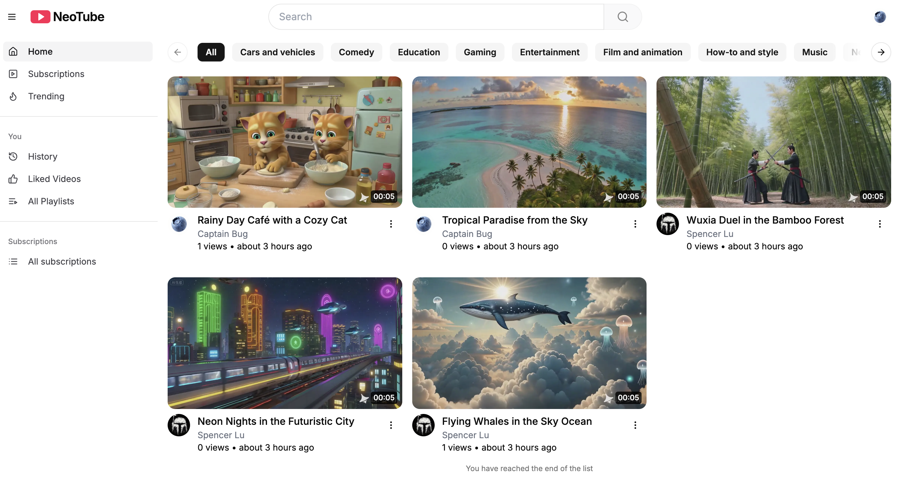

# NeoTube



A full-featured YouTube-inspired platform built with modern web technologies and enhanced by powerful AI integrations. This project replicates core YouTube functionalities while introducing smart, AI-driven jobs for a next-gen video experience.

## Tech Stack

- **Framework:** Next.js 15, React 19, tRPC
- **Styling:** TailwindCSS, ShadcnUI
- **Database:** PostgreSQL (Neon) with DrizzleORM
- **Video Infrastructure:** Mux

## Key Features

🎬 **Real-Time Video Processing** – Powered by Mux for fast uploads & streaming

📝 **Auto Transcription** – AI-generated transcripts for uploaded videos

🤖 **AI-Powered Content** – Automatic title & description suggestions

⚡ **Dynamic Feeds** – Personalized and trending content feeds

🗂️ **Playlist Management** – Custom playlists for users

💬 **Comment System** – Engage with interactive comments

👍 **Likes & Subscriptions** – Support for engagement and follow  

🎯 **Watch History** – Tracks and resumes viewed content  

## Quick Start

1. **Clone the repository:**

```bash
git clone https://github.com/chabao18/NeoTube.git
```

2. **Install dependencies:**

```bash
cd NeoTube
pnpm install
```

3. **Set up environment variables:**

```bash
cp .env.example .env.local
# Fill in the required credentials
```

4. **Run the app:**

```bash
pnpm dev
```

## License

This project is licensed under the [MIT License](./LICENSE).

